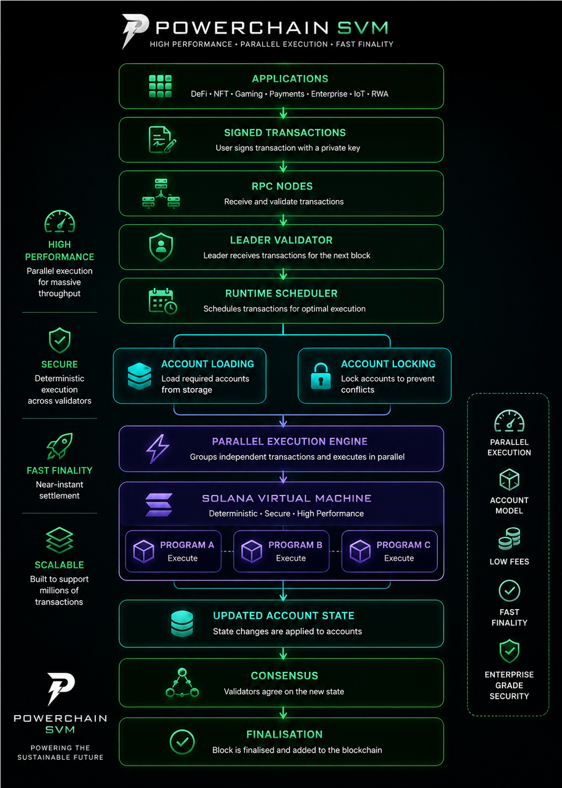

# PowerChain Virtual Machine™ (PVM)

> **The Sustainable Blockchain Runtime**  
> **Powered by the Solana Virtual Machine (SVM)**

<p align="center">
  
</p>

<p align="center">


</p>

---

# Overview

**PowerChain Virtual Machine (PVM)** is the native execution layer of the PowerChain blockchain.

Built on the battle-tested **Solana Virtual Machine (SVM)**, PVM combines Solana's high-performance parallel execution engine with PowerChain's renewable energy, carbon market, digital asset and enterprise infrastructure.

Rather than creating an entirely new virtual machine, PowerChain extends the proven SVM architecture with native protocols that enable programmable renewable energy, tokenised real-world assets, intelligent automation, decentralised finance and enterprise applications.

PVM maintains compatibility with the Solana ecosystem while introducing a blockchain purpose-built for the global sustainable economy.

---

# Vision

PowerChain enables a future where every renewable energy asset, carbon credit, battery, electric vehicle, renewable certificate and real-world asset can be securely represented, verified, tokenised and settled on-chain.

PowerChain is building digital infrastructure for:

- Renewable Energy
- Carbon Markets
- Real-World Assets (RWAs)
- Enterprise Finance
- AI Infrastructure
- Utilities
- Governments
- Smart Cities
- IoT Networks

---

# Why PowerChain?

Traditional blockchains were designed for cryptocurrencies.

PowerChain is designed for infrastructure.

It combines blockchain, renewable energy, artificial intelligence and enterprise-grade architecture into a single programmable platform.

## Core Benefits

- Parallel execution
- Near real-time settlement
- Ultra-low transaction costs
- Renewable energy verification
- Carbon asset infrastructure
- Native RWA tokenisation
- Enterprise APIs
- AI-powered automation
- Solana compatibility
- Sui interoperability

---

# Architecture

<p align="center">
  
</p>

The PowerChain execution pipeline consists of:

1. Applications create transactions.
2. RPC nodes validate requests.
3. Validators receive transactions.
4. Runtime Scheduler analyses dependencies.
5. Accounts are loaded.
6. Account locking prevents conflicts.
7. Transactions execute in parallel.
8. PVM executes smart contracts.
9. Native protocols update blockchain state.
10. Proof of Generation validates renewable generation.
11. Proof of Stake finalises blocks.

---

# PowerChain Stack

```text
Applications
        │
        ▼
PowerChain SDK
        │
        ▼
PowerChain Runtime
        │
        ▼
PowerChain Virtual Machine (PVM)
        │
        ▼
Solana Virtual Machine (SVM)
        │
        ▼
Proof of Generation
        │
        ▼
Proof of Stake
        │
        ▼
Validators
        │
        ▼
Blockchain State
```

---

# Runtime Components

| Component | Description |
|------------|-------------|
| Transaction Engine | Processes signed transactions |
| Runtime Scheduler | Parallel transaction scheduling |
| Account Manager | Loads blockchain state |
| Account Locking | Prevents write conflicts |
| Parallel Executor | Executes transactions simultaneously |
| Compute Manager | Compute Unit accounting |
| CPI Runtime | Cross Program Invocation |
| Event Engine | Runtime events |
| Security Manager | Ownership validation |
| State Manager | Blockchain state transitions |

---

# PowerChain Virtual Machine

PVM extends the Solana execution model with enterprise and sustainability capabilities.

Core features include:

- Parallel execution
- Compute Units
- Deterministic runtime
- Account model
- Rust smart contracts
- Anchor compatibility
- Cross Program Invocation (CPI)
- Native protocol execution
- Event processing
- Enterprise security

---

# Proof of Generation (PoG)

PowerChain introduces **Proof of Generation (PoG)**, a renewable infrastructure protocol that verifies clean energy generation before environmental assets are issued on-chain.

Unlike traditional blockchain consensus mechanisms, PoG validates trusted generation events using multiple independent data sources.

Supported verification sources include:

- Solar generation
- Wind generation
- Hydroelectric facilities
- Battery storage
- Smart meters
- Utility operators
- Grid telemetry
- Weather services
- Carbon registries
- AI forecasting
- IoT devices
- Supply-chain systems
- Traffic and mobility networks

Verified generation events may produce:

- Renewable Energy Certificates (RECs)
- Guarantees of Origin (GOs)
- Carbon Credits
- Renewable Asset Tokens

PoG complements Proof of Stake rather than replacing it.

---

# Consensus

PowerChain combines two complementary mechanisms.

## Proof of Generation (PoG)

Validates renewable energy generation and environmental assets.

↓

## Proof of Stake (PoS)

Secures the blockchain through validator consensus and block finalisation.

---

# Native Protocols

PowerChain includes specialised blockchain protocols.

## Energy Protocol

- Renewable generation
- Battery storage
- Smart grids
- Virtual power plants
- Energy settlement

---

## Carbon Protocol

- Carbon credits
- Verification
- Trading
- Retirement
- ESG reporting

---

## Asset Protocol

Supports tokenisation of:

- Renewable infrastructure
- Real estate
- Commodities
- Treasury assets
- Infrastructure funds

---

## Treasury Protocol

Provides:

- DAO treasury
- Validator incentives
- Community grants
- Ecosystem funding

---

## Oracle Protocol

Provides trusted external data.

Supported sources:

- Electricity prices
- Weather services
- Grid operators
- Carbon registries
- Renewable production
- AI forecasting
- Supply chain systems
- Smart meters
- IoT sensors

---

## Identity Protocol

Supports:

- Enterprise identity
- Compliance
- Institutional permissions
- Digital credentials

---

## AI Protocol

Artificial intelligence services include:

- Grid optimisation
- Renewable forecasting
- Carbon accounting
- Predictive maintenance
- Fraud detection
- Market intelligence
- Validator optimisation
- Autonomous energy agents

---

# Smart Contracts

PowerChain smart contracts are called **Programs**.

Developers can build using:

- Rust
- Anchor
- Solana SDK
- TypeScript
- Existing Solana tooling

Most Solana applications can migrate with minimal changes.

---

# Cross-Chain

PowerChain provides interoperability with high-performance blockchain ecosystems.

Supported networks:

- Solana
- Sui

Capabilities include:

- Wrapped PWRC
- Cross-chain messaging
- Asset transfers
- Shared liquidity
- Oracle synchronisation
- Enterprise settlement

---

# Developer Platform

Languages

- Rust
- C
- C++

Frameworks

- Anchor
- Native SDK

SDKs

- TypeScript
- Rust
- Go
- Python
- Kotlin
- Swift

Developer tools

- PowerChain CLI
- Local Validator
- Devnet
- Testnet
- Explorer
- Faucet
- GraphQL API
- RPC API

---

# Enterprise Features

PowerChain includes:

- Multi-signature wallets
- Hardware Security Module (HSM) support
- Compliance framework
- Enterprise identity
- Audit logs
- Treasury controls
- Institutional APIs
- Permission management

---

# Performance Targets

| Metric | Target |
|---------|--------:|
| Runtime | PVM |
| Execution Engine | Solana Virtual Machine |
| Consensus | PoG + PoS |
| Block Time | ~400 ms |
| Finality | 2–5 seconds |
| Transaction Fees | Very Low |
| Smart Contract Language | Rust |
| Parallel Execution | Thousands of transactions |
| Cross-chain | Solana + Sui |

---

# Roadmap

## Phase 1

- PVM Runtime
- Validator Network
- Devnet
- Explorer
- SDK

---

## Phase 2

- Proof of Generation
- Oracle Network
- Carbon Registry
- Energy Protocol

---

## Phase 3

- Asset Tokenisation
- Treasury
- AI Infrastructure
- Governance

---

## Phase 4

- Mainnet
- Enterprise APIs
- Cross-chain Interoperability
- Global Energy Marketplace

---

# Repository Structure

```text
powerchain-pvm/
│
├── docs/
│   ├── README.md
│   ├── VISION.md
│   ├── ARCHITECTURE.md
│   ├── PVM.md
│   ├── POG.md
│   ├── CONSENSUS.md
│   ├── VALIDATORS.md
│   ├── SMART-CONTRACTS.md
│   ├── ENERGY-PROTOCOL.md
│   ├── CARBON-PROTOCOL.md
│   ├── ORACLE.md
│   ├── CROSS-CHAIN.md
│   ├── SECURITY.md
│   ├── ROADMAP.md
│   └── API.md
│
├── programs/
├── runtime/
├── validator/
├── sdk/
├── cli/
├── explorer/
├── assets/
└── examples/
```

---

# The Future of Sustainable Infrastructure

PowerChain Virtual Machine is more than a blockchain runtime.

It is a programmable execution layer for renewable energy, environmental assets, enterprise finance and intelligent digital infrastructure.

By combining the proven performance of the Solana Virtual Machine with PowerChain's native protocols, Proof of Generation, AI-powered oracle network and cross-chain interoperability, PVM provides the foundation for the next generation of sustainable digital economies.

## Build Sustainable Infrastructure.

## Build on PowerChain.

---

# License

Licensed under the Apache License 2.0.

Copyright © 2026 PowerChain Foundation. All rights reserved.
