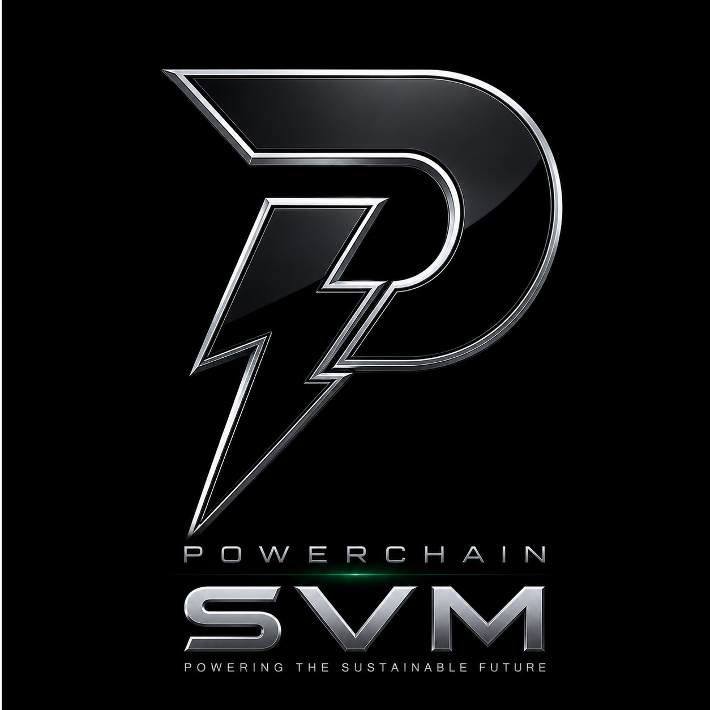

# Solana Virtual Machine (SVM)
**Draft**

<p align="center">
  
</p>

<p align="center">


</p>

---

# Solana Virtual Machine (SVM)

The **Solana Virtual Machine (SVM)** is the high-performance execution environment that powers the Solana blockchain. It is responsible for executing smart contracts (called **programs**), validating transactions, managing account state, and enabling massively parallel transaction processing.

Unlike traditional blockchain virtual machines that execute transactions sequentially, the SVM is designed for **parallel execution**, allowing thousands of independent transactions to run simultaneously while maintaining deterministic state.

This architecture enables:

- Ultra-low transaction fees
- High throughput
- Fast finality
- Horizontal scalability
- Efficient resource utilisation

---

# Table of Contents

- Overview
- Architecture
- How the SVM Works
- Account Model
- Parallel Execution
- Compute Units
- Programs
- Cross Program Invocation (CPI)
- Transaction Lifecycle
- Account Locking
- Runtime Security
- Advantages over EVM
- Development Stack
- SVM Ecosystem
- SVM Rollups
- Performance
- Example Workflow
- Best Practices
- Resources
- License

---

# Overview

The Solana Virtual Machine executes every on-chain transaction across the Solana network.

Its responsibilities include:

- Loading accounts
- Executing programs
- Validating signatures
- Managing compute budgets
- Processing CPI calls
- Updating account state
- Returning execution logs

Unlike Ethereum's EVM, where every transaction waits for the previous one, the SVM executes independent transactions concurrently.

---

# Architecture

```text
                    Applications
                          │
                          ▼
                 Signed Transactions
                          │
                          ▼
                     RPC Nodes
                          │
                          ▼
                  Leader Validator
                          │
                          ▼
                 Runtime Scheduler
                          │
         ┌────────────────┴───────────────┐
         │                                │
         ▼                                ▼
 Account Loading                 Account Locking
         │                                │
         └──────────────┬─────────────────┘
                        ▼
              Parallel Execution Engine
                        │
                        ▼
                Solana Virtual Machine
                        │
      ┌─────────────────┼─────────────────┐
      │                 │                 │
      ▼                 ▼                 ▼
 Program A         Program B        Program C
      │                 │                 │
      └─────────────────┼─────────────────┘
                        ▼
                Updated Account State
                        │
                        ▼
                    Consensus
                        │
                        ▼
                    Finalisation
```

---

# How the SVM Works

Every transaction follows the same execution flow.

1. User signs transaction
2. Transaction sent to RPC node
3. Validator receives transaction
4. Accounts are loaded
5. Runtime determines dependencies
6. Scheduler groups transactions
7. Independent transactions execute simultaneously
8. Programs update accounts
9. State committed
10. Block finalised

---

# Account Model

Unlike Ethereum, Solana stores everything inside accounts.

Every account contains:

- Public key
- Owner program
- Lamports (SOL)
- Data
- Executable flag
- Rent metadata

Example

```text
Wallet

Token Account

NFT

Oracle

Liquidity Pool

Treasury
```

Programs themselves remain stateless.

All persistent data is stored inside accounts.

---

# Parallel Execution

Parallel execution is the defining feature of the SVM.

Traditional Virtual Machines

```text
TX1

↓

TX2

↓

TX3

↓

TX4
```

Solana Virtual Machine

```text
TX1 ─────┐

TX2 ─────┼──── Execute Together

TX3 ─────┤

TX4 ─────┘
```

Transactions touching different writable accounts execute simultaneously.

Benefits include:

- Massive scalability
- High TPS
- Low latency
- Efficient CPU utilisation
- Better validator performance

---

# Compute Units

Instead of gas, Solana measures execution using **Compute Units (CU)**.

Typical workloads

| Transaction | Compute Units |
|-------------|--------------:|
| SOL Transfer | 5,000 |
| SPL Transfer | 8,000 |
| Token Swap | 120,000 |
| NFT Mint | 150,000 |
| DeFi Protocol | 250,000+ |

Developers can:

- Request additional compute
- Set priority fees
- Optimise execution costs

---

# Programs

Smart contracts on Solana are called **Programs**.

Programs are:

- Stateless
- Deterministic
- Immutable by default
- Shared by every user

Common Programs

- System Program
- SPL Token Program
- Stake Program
- Vote Program
- Memo Program
- Associated Token Program
- Anchor Programs

Execution

```text
Transaction

↓

Program

↓

Read Accounts

↓

Modify Accounts

↓

Return
```

---

# Cross Program Invocation (CPI)

Programs can safely invoke other programs.

Example

```text
DEX

↓

Token Program

↓

Oracle

↓

Memo Program

↓

Return
```

This enables composable DeFi applications.

---

# Transaction Lifecycle

```text
Wallet

↓

Sign

↓

RPC

↓

Leader Validator

↓

Account Loading

↓

Parallel Scheduler

↓

SVM Execution

↓

Consensus

↓

Finality
```

---

# Account Locking

The SVM locks writable accounts.

Read-only accounts remain shared.

Example

```text
Account A

Write

↓

Locked
```

```text
Account B

Read

↓

Shared
```

This prevents race conditions while allowing maximum concurrency.

---

# Runtime Security

The runtime enforces:

- Deterministic execution
- Memory safety
- Compute limits
- Heap limits
- Stack limits
- Signature verification
- Ownership rules
- Read/write permissions
- No floating-point arithmetic

Every validator produces identical execution results.

---

# Advantages over Ethereum Virtual Machine

| Feature | SVM | EVM |
|----------|-----|-----|
| Execution | Parallel | Sequential |
| Storage | Accounts | Global State |
| Throughput | Very High | Lower |
| Fees | Very Low | Higher |
| Compute | Compute Units | Gas |
| Languages | Rust, C, C++, Anchor | Solidity, Vyper |
| Finality | Fast | Network Dependent |
| Scheduler | Built-in | None |

---

# Development Stack

The typical SVM development stack includes:

## Languages

- Rust
- C
- C++

## Frameworks

- Anchor
- Native Solana SDK

## SDKs

- @solana/web3.js
- Solana Kit
- Anchor Client

## Tooling

- Solana CLI
- Local Validator
- Test Validator
- Anchor CLI

---

# Performance

Typical Solana network capabilities

| Metric | Value |
|---------|--------:|
| Block Time | ~400 ms |
| Finality | ~2–5 seconds |
| Compute Budget | Configurable |
| Average Fee | Fractions of a cent |
| Parallel Transactions | Thousands |

Actual performance depends on validator hardware, network conditions, and workload.

---

# SVM Ecosystem

The Solana Virtual Machine now powers more than just the Solana mainnet.

Modern SVM deployments include:

- Solana Mainnet
- App-specific SVM chains
- Modular SVM rollups
- Enterprise SVM networks
- Permissioned SVM deployments
- High-performance DeFi infrastructure
- Gaming ecosystems
- DePIN platforms
- Real-world asset platforms

---

# SVM Rollups

SVM execution can be combined with external settlement layers.

Architecture

```text
Users

↓

SVM Execution Layer

↓

Rollup

↓

Settlement Layer

↓

Final State
```

Benefits

- Increased scalability
- Lower operating costs
- Dedicated application chains
- Solana-compatible tooling
- High throughput

---

# Example Workflow

```text
User

↓

Wallet

↓

Swap Transaction

↓

RPC

↓

Validator

↓

Account Loader

↓

Parallel Scheduler

↓

SVM

↓

Token Program

↓

Liquidity Pool

↓

Updated Accounts

↓

Finality
```

---

# Best Practices

- Keep accounts small
- Minimise writable accounts
- Reduce CPI depth
- Optimise compute usage
- Cache account data
- Use Program Derived Addresses (PDAs)
- Validate all account ownership
- Prefer deterministic logic
- Profile compute usage
- Test with a local validator

---

# Resources

- Solana Documentation
- Solana Cookbook
- Anchor Framework
- Solana Program Library (SPL)
- Solana CLI
- Solana Web3.js SDK

---

# Why the SVM Matters

The Solana Virtual Machine represents a new generation of blockchain execution.

Its parallel architecture enables developers to build applications that require:

- High transaction throughput
- Near real-time execution
- Low-cost transactions
- Massive scalability
- Enterprise-grade performance
- Efficient resource utilisation

The SVM has become one of the leading execution environments for decentralised finance, payments, gaming, real-world assets, DePIN, AI infrastructure, and next-generation Web3 applications.

---

# License

Licensed under the Apache License 2.0.

Copyright © 2026
